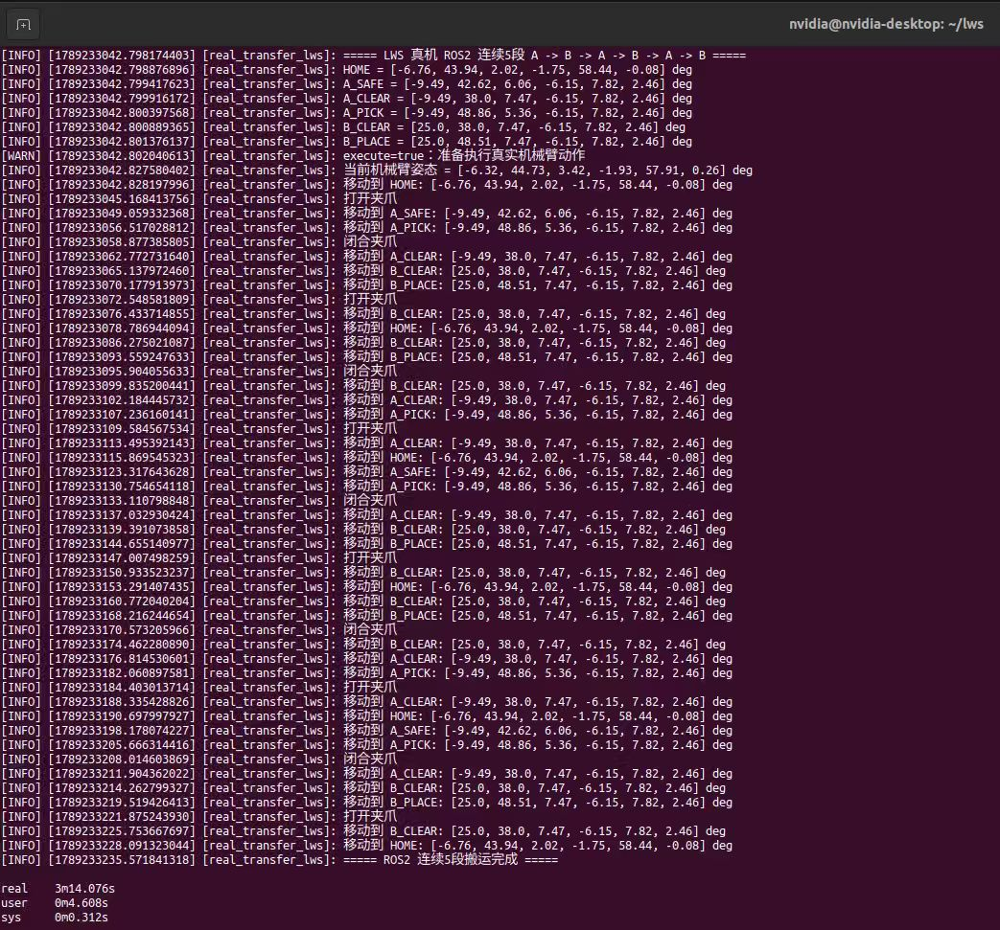
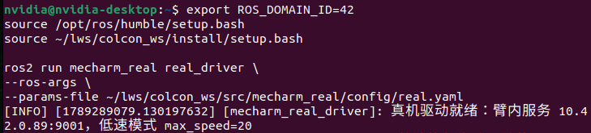

# Experiment 2 — mechArm270 Fixed-Point Grasping

ROS 2 Humble based fixed-point pick-and-place experiment using Gazebo / Ignition simulation and a real mechArm270 robotic arm.

## Repository structure

```text
Experiment_2/
├── simulation/
│   ├── code/
│   ├── config/
│   ├── logs/
│   ├── screenshots/
│   └── README.md
├── real_robot/
│   ├── code/
│   ├── config/
│   ├── logs/
│   ├── screenshots/
│   └── README.md
└── report/              # LaTeX report will be added in the next commit
```

## Workflow
Home → above Point A → descend → close gripper → lift → Point B → release → Home.

## Simulation evidence

### Gazebo scene


### Task execution


### Terminal / result evidence


## Real-robot evidence

### Real-robot task execution


### ROS 2 real-arm driver


### Joint-state feedback


### Safety / abnormal test


## Validation
The real-robot validation record reports 5 successful runs out of 5, with no collision recorded. The repository also preserves trajectory / execution logs and an abnormal joint-limit test as safety evidence.

## Platform
Ubuntu 22.04 · ROS 2 Humble · Gazebo / Ignition · MoveIt 2 / ros2_control · Jetson Orin · Elephant Robotics mechArm270

## Note
Demonstration videos are submitted separately according to the course requirements. The LaTeX experiment report will be added under `report/` in a subsequent commit.
