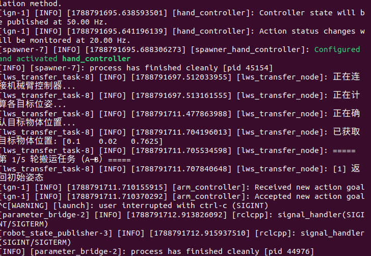
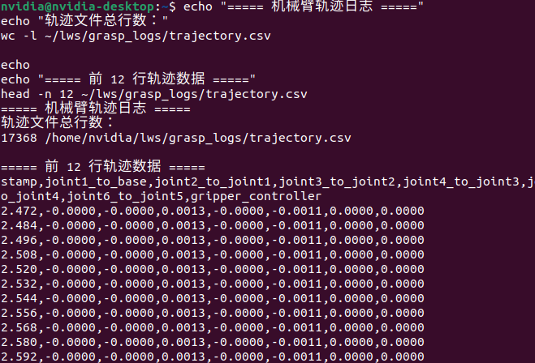
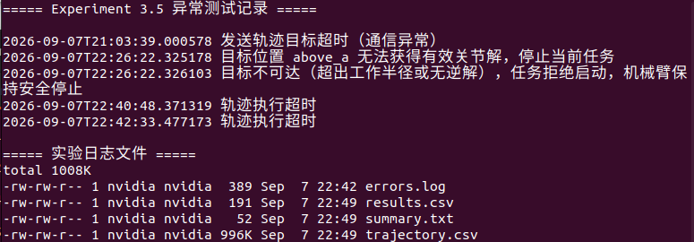
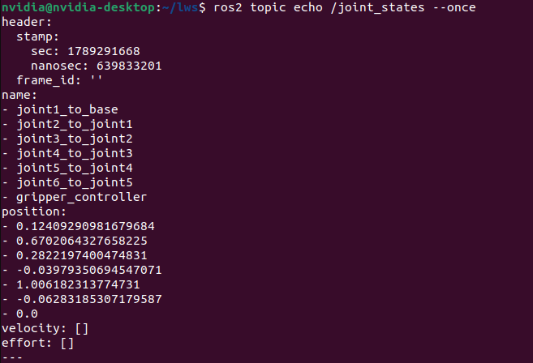
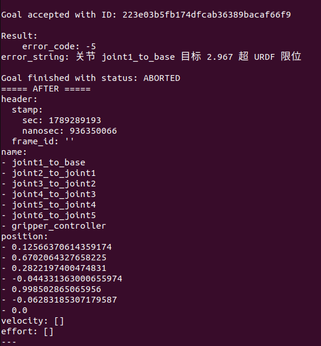

# Experiment 2 — mechArm270 Fixed-Point Grasping

## 1. Project Overview

This project implements a complete fixed-point pick-and-place task using a **mechArm270 robotic arm** based on **ROS 2 Humble**.

The experiment was completed in two stages:

- **Simulation:** Gazebo / Ignition + ROS 2 + MoveIt 2 / ros2_control
- **Real Robot:** Jetson Orin + mechArm270 + ROS 2 real-robot driver

The complete manipulation workflow is:

**Home → Move above Point A → Descend → Close Gripper → Lift → Move to Point B → Release → Return Home**

The task uses predefined pick-and-place positions and does not rely on visual localization.

The experiment verifies fixed-point grasping, repeated execution, trajectory recording, ROS 2 joint-state feedback, and safety handling for abnormal or unreachable commands.

---

## 2. Repository Structure

The repository is organized into corresponding simulation and real-robot sections.

```text
Experiment_2/
├── README.md
│
├── simulation/
│   ├── code/
│   ├── config/
│   ├── logs/
│   ├── screenshots/
│   └── README.md
│
└── real_robot/
    ├── code/
    ├── config/
    ├── logs/
    ├── screenshots/
    └── README.md
```

Both stages use the same basic organization:

- `code/` — ROS 2 nodes and task programs
- `config/` — robot and task parameters
- `logs/` — experiment results, trajectories, and error records
- `screenshots/` — key experimental evidence
- `README.md` — stage-specific documentation

---

## 3. System Architecture

ROS 2 is used as the common control framework for both simulation and real-robot execution.

```text
                    ROS 2 Task Node
                          |
                          v
                 Trajectory Command
                          |
             +------------+------------+
             |                         |
             v                         v
      Simulation Stage          Real-Robot Stage
   Gazebo / Ignition           mechArm270 Driver
             |                         |
             v                         v
      Simulated Robot             Real Robot
             |                         |
             +------------+------------+
                          |
                          v
                 /joint_states Feedback
```

The simulation stage is first used to verify the task logic and robot motion. After successful simulation verification, the same ROS 2 control concept is transferred to the physical mechArm270 platform.

---

## 4. Simulation Environment

The simulation stage was implemented using:

- Ubuntu 22.04
- ROS 2 Humble
- Gazebo / Ignition
- MoveIt 2
- ros2_control
- mechArm270 robot model
- Adaptive gripper
- Fixed table and target object

The simulated scene contains the robotic arm, gripper, working table, and grasping object.

### 4.1 Simulation Scene

The following figure shows the mechArm270 simulation environment and target object.


The robot is positioned beside the worktable, and the target object is placed at the predefined grasping point.

### 4.2 Robot and Workspace

The complete robot model and workspace were verified in Gazebo before executing the grasping task.



This stage was used to verify robot model loading, joint configuration, gripper configuration, collision geometry, and workspace arrangement.

---

## 5. Fixed-Point Pick-and-Place Task

Two predefined locations are used:

- **Point A:** grasping position
- **Point B:** placement position

A safe height is defined above the workspace to reduce the possibility of collision during horizontal motion.

The task sequence is:

1. Return the robot to the Home position.
2. Open the gripper.
3. Move to the safe position above Point A.
4. Descend to the grasping position.
5. Close the gripper.
6. Lift the object vertically.
7. Move through the safe region toward Point B.
8. Descend to the placement position.
9. Open the gripper.
10. Return to the safe height.
11. Return the robot to Home.

### 5.1 Task Execution


The task node executes the predefined sequence through ROS 2 and sends trajectory commands to the robot controller.

---

## 6. Simulation Validation

The simulation was tested repeatedly to evaluate the stability of the complete grasping workflow.

The experiment records include:

- grasping result
- target position
- trajectory information
- execution summary
- abnormal-condition records

### 6.1 Terminal Execution

The following screenshot shows the ROS 2 task running from the terminal.


### 6.2 Repeated Grasping Test

Five consecutive grasping cycles were executed.



The recorded results were:

```text
cycle,success,object_x,object_y,object_z,detail
1,1,0.0699,-0.0800,0.7625,ok
2,1,0.1041,0.0203,0.7625,ok
3,1,0.0701,-0.0799,0.7625,ok
4,1,0.1041,0.0207,0.7625,ok
5,1,0.0710,-0.0799,0.7625,ok
```

Therefore:

**Simulation result: 5/5 grasping cycles completed successfully.**

Trajectory data were also recorded during execution for later analysis.

---

## 7. Abnormal and Safety Test

Safety handling was tested by intentionally providing an invalid or unreachable target.

The control program detects abnormal conditions such as:

- unreachable target position
- invalid inverse-kinematics solution
- joint-limit violation
- trajectory execution timeout

When an invalid target is detected, the current task is rejected or stopped instead of forcing the robot to continue moving.



The error log records abnormal events and provides diagnostic information.

This verifies that the system can stop safely when the requested target cannot be executed.

---

## 8. Real-Robot Implementation

After the simulation workflow was verified, the task was transferred to the physical robot.

The real-robot platform consists of:

- NVIDIA Jetson Orin
- Elephant Robotics mechArm270
- Gripper
- ROS 2 Humble
- Real-robot ROS 2 driver
- Fixed-point grasping task node

The real-robot stage retains the ROS 2 trajectory-control architecture while replacing the simulation interface with hardware communication.

---

## 9. Real-Robot Driver

The real robot is controlled through the ROS 2 driver running on the Jetson platform.

The following screenshot shows the driver successfully entering the ready state.


The driver communicates with the mechArm270 and provides the ROS 2 interface required by the grasping task.

---

## 10. Continuous Real-Robot Transfer Test

The physical robot was tested using repeated fixed-point transfer sequences.

The real-robot sequence includes:

```text
HOME
→ A_SAFE
→ A_PICK
→ Close Gripper
→ A_CLEAR
→ B_CLEAR
→ B_PLACE
→ Open Gripper
→ B_CLEAR
→ HOME
```

The task was further tested using repeated bidirectional transfer:

```text
A → B → A → B → A → B
```

The following terminal output shows the continuous ROS 2 execution process.


The continuous transfer sequence completed successfully, demonstrating that the robot could repeatedly execute the predefined joint trajectories.

---

## 11. ROS 2 Joint-State Feedback

The physical robot publishes its current joint state through ROS 2.

The `/joint_states` topic was used to verify that joint feedback could be received correctly.



The returned state contains the positions of:

- `joint1_to_base`
- `joint2_to_joint1`
- `joint3_to_joint2`
- `joint4_to_joint3`
- `joint5_to_joint4`
- `joint6_to_joint5`
- `gripper_controller`

This confirms the feedback path between the physical robot driver and ROS 2.

---

## 12. Real-Robot Safety Verification

A joint-limit test was performed to verify the safety behavior of the physical robot.

An intentionally invalid joint target was sent to the controller.

The controller detected that the requested value exceeded the URDF joint limit and rejected the command.



The returned result included:

```text
error_code: -5
error_string: joint joint1_to_base target 2.967 exceeds URDF limit
Goal finished with status: ABORTED
```

The robot did not execute the invalid target.

This test demonstrates that the real-robot control system can reject unsafe commands before physical motion occurs.

---

## 13. Experimental Results

The main results of Experiment 2 are summarized below.

| Test | Result |
|---|---|
| Simulation environment startup | Passed |
| ROS 2 trajectory control | Passed |
| Fixed-point grasping workflow | Passed |
| Simulation repeated grasping | 5/5 completed |
| Trajectory recording | Completed |
| Abnormal target handling | Passed |
| Real-robot ROS 2 driver | Passed |
| Real-robot joint-state feedback | Passed |
| Real-robot fixed-point transfer | Passed |
| Five consecutive bidirectional transfer segments | Completed |
| Joint-limit safety test | ABORTED as expected |

The experiment demonstrates that the fixed-point manipulation workflow can first be developed and verified in simulation and then transferred to a physical mechArm270 robot while retaining the ROS 2 control architecture.

---

## 14. Key Parameters

The fixed-point task uses predefined positions, offsets, safe height, motion duration, and repeat count.

Representative parameters used during the experiment include:

```yaml
station_a_position: [0.10, 0.02, 0.7635]
station_b_position: [0.07, -0.08, 0.7635]

safe_height: 0.065

station_a_offset: 0.002
station_b_offset: 0.008

placement_tolerance: 0.03
tool_tip_offset: 0.063

arm_move_time: 4.5
gripper_move_time: 1.2

repeat_count: 5
```

These parameters define the fixed pick-and-place workspace and the timing of the robot motion.

---

## 15. Logs and Reproducibility

Experimental evidence is retained in the repository instead of only presenting final screenshots.

The simulation and real-robot folders contain corresponding `logs/` directories for:

- trajectory records
- execution results
- summary information
- abnormal-condition records

This allows the experiment results to be inspected after execution and improves reproducibility.

The source code and configuration files are also retained separately so that the experiment structure, task parameters, and control implementation can be reviewed.

---

## 16. Conclusion

Experiment 2 successfully implemented a complete ROS 2 based fixed-point grasping and transfer workflow for the mechArm270 robotic arm.

The task was first developed and validated in Gazebo / Ignition simulation. The simulation stage verified robot motion, gripper operation, fixed-point task sequencing, repeated execution, trajectory recording, and abnormal-condition handling.

After simulation verification, the same overall ROS 2 control architecture was transferred to the physical mechArm270 platform. The real-robot tests verified hardware communication, trajectory execution, gripper operation, joint-state feedback, repeated fixed-point transfer, and joint-limit protection.

The final system therefore demonstrates the complete workflow:

**Simulation Verification → ROS 2 Control Validation → Real-Robot Deployment → Repeated Execution → Safety Verification**

---

## 17. Repository Contents

For detailed files, see:

- [`simulation/`](simulation/) — simulation code, configuration, logs, and screenshots
- [`real_robot/`](real_robot/) — real-robot code, configuration, logs, and screenshots

The formal **LaTeX experiment report** and demonstration videos are prepared separately according to the course submission requirements.
