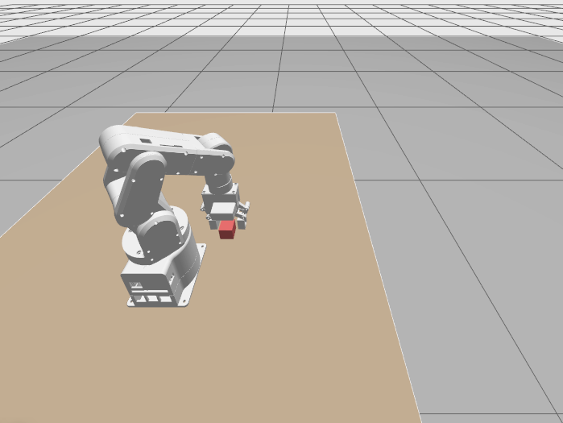
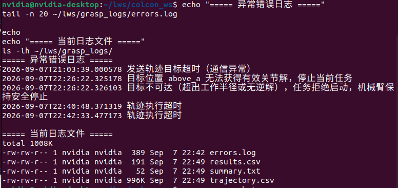
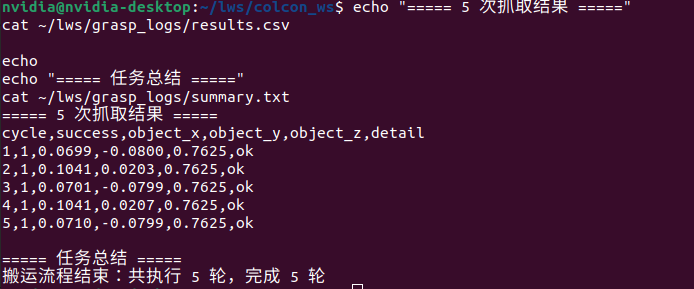

# Simulation — mechArm270 Fixed-Point Grasping

Gazebo / Ignition simulation for the fixed-point pick-and-place task.

This directory contains the ROS 2 simulation implementation used to validate the grasping and object-transfer workflow of the mechArm270 before physical-robot testing.

## Directory structure

```text
simulation/
├── code/
│   ├── final_grasp.launch.py
│   ├── final_grasp_task.py
│   ├── lws_transfer.launch.py
│   ├── lws_transfer_task.py
│   ├── package.xml
│   ├── setup.cfg
│   ├── setup.py
│   └── setup2.py
│
├── config/
│   ├── final_grasp_params.yaml
│   ├── lws_transfer_params.yaml
│   └── lws_transfer_world.sdf
│
├── logs/
├── screenshots/
└── README.md
```

- `code/`: ROS 2 task nodes, launch files and package metadata
- `config/`: task parameters and simulation world
- `logs/`: repeated-run results, trajectory records and abnormal-test logs
- `screenshots/`: selected simulation evidence

## Final simulation implementation

The simulation package preserves both the earlier development files and the finalized files.

The **final version used for the completed simulation experiment** is:

```text
final_grasp_task.py
final_grasp.launch.py
setup2.py
final_grasp_params.yaml
```

Their roles are:

- `final_grasp_task.py`: final ROS 2 task node for the grasping and transfer procedure
- `final_grasp.launch.py`: final launch file used to start the simulation workflow
- `setup2.py`: finalized package setup configuration used by the group
- `final_grasp_params.yaml`: parameter file for the final task implementation

The earlier files are retained for development history and reference:

```text
lws_transfer_task.py
lws_transfer.launch.py
setup.py
lws_transfer_params.yaml
```

These earlier files document the initial implementation and debugging process, but they are **not the main files used for the final simulation result**.

The shared files, such as `package.xml`, `setup.cfg`, and `lws_transfer_world.sdf`, continue to support the same ROS 2 package and Gazebo / Ignition simulation environment.

## Task workflow

The simulated robot performs the following fixed-point pick-and-place sequence:

```text
Home
  ↓
Above Point A
  ↓
Descend to grasp
  ↓
Close gripper
  ↓
Lift object
  ↓
Move above Point B
  ↓
Descend to placement height
  ↓
Open gripper
  ↓
Lift
  ↓
Return Home
```

The task can be repeated for multiple cycles to evaluate the stability of the grasping procedure.

## Version relationship

The repository keeps the earlier and final implementations together so that the development process remains traceable.

```text
Initial implementation
        │
        │ development / debugging / validation
        ↓
Final implementation
        │
        │ final_grasp_task.py
        │ final_grasp.launch.py
        │ setup2.py
        │ final_grasp_params.yaml
        ↓
Final simulation results
```

The final implementation keeps the same experimental objective and simulation environment while reorganizing the task code into a clearer and more maintainable structure.

## Launch

The final simulation is launched with:

```bash
source ~/colcon_ws/install/setup.bash
ros2 launch mecharm_grasp_lws final_grasp.launch.py
```

The main startup sequence is:

```text
Gazebo / Ignition
      ↓
robot_state_publisher
      ↓
Robot spawn
      ↓
joint_state_broadcaster
      ↓
arm_controller + hand_controller
      ↓
final_grasp_task
```

Only one task implementation should be run at a time so that two independent task nodes do not command the same simulated robot simultaneously.

## Configuration

`final_grasp_params.yaml` contains the parameters used by the final task implementation, including the grasping and placement positions, approach height, tool-tip offset, gripper positions, motion timing and repetition settings.

The final implementation and the earlier implementation share the same basic robot model, simulation world and experimental task geometry.

## Logs

The `logs/` directory stores experimental records such as:

- trajectory records
- repeated execution results
- abnormal-test / error records

These files are used as supporting evidence for task verification and the experiment report.

## Simulation evidence

The original simulation screenshots are retained.

### Gazebo scene



### Task execution



### Terminal / result evidence



## Platform

Ubuntu 22.04 · ROS 2 Humble · Gazebo / Ignition Fortress · MoveIt 2 · ros2_control · Elephant Robotics mechArm270

## Note

The simulation is used to validate robot motion, gripper operation, fixed-point grasping, object transfer, repeated execution and abnormal conditions before the corresponding real-robot experiment.
